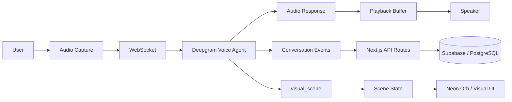
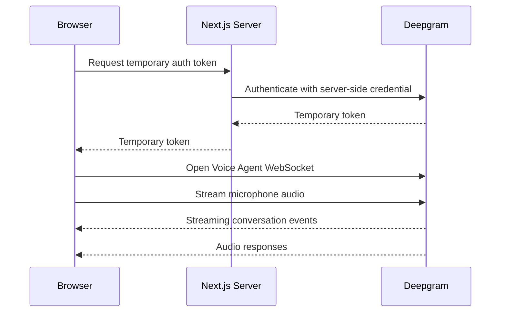
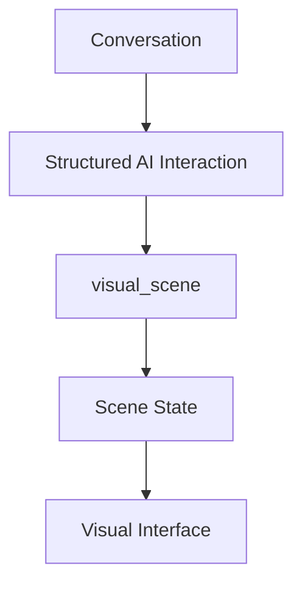
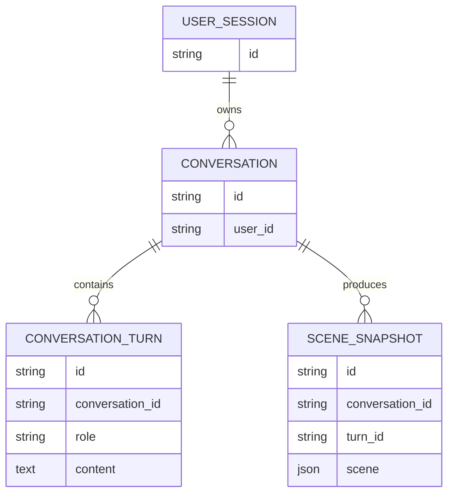
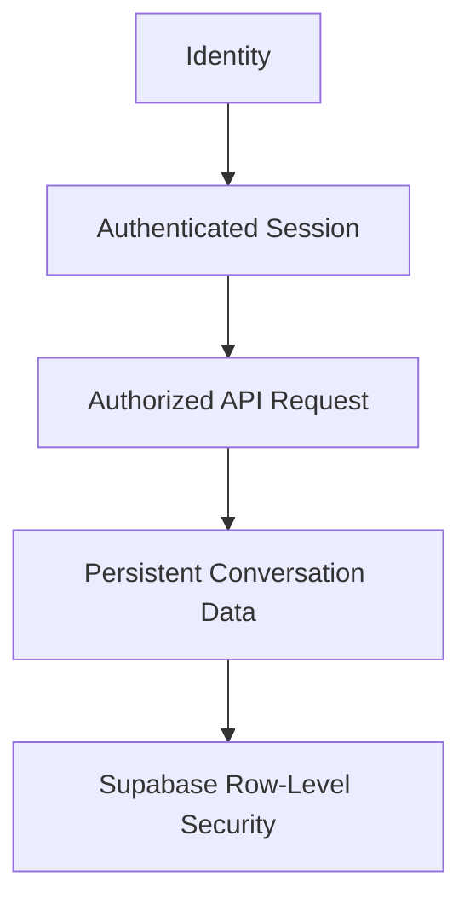
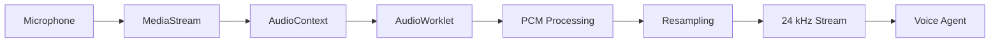
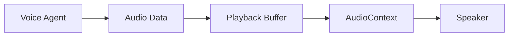
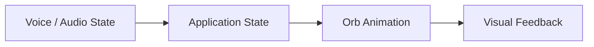
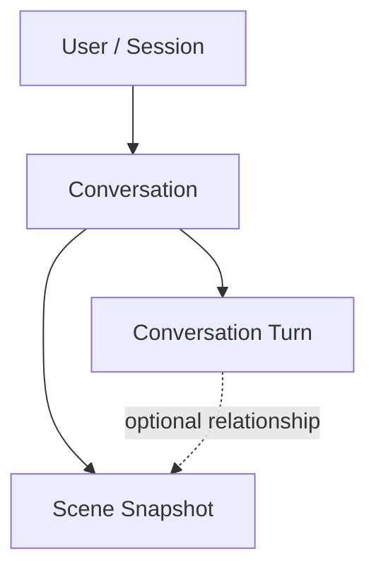

# 🌌 NEON — Real-Time Voice AI

> **A cinematic real-time voice assistant built with Next.js, Deepgram, Supabase, WebSockets, custom audio processing, and persistent conversational state.**

[](https://nextjs.org/)
[](https://react.dev/)
[](https://www.typescriptlang.org/)
[](https://supabase.com/)
[](https://deepgram.com/)
[](https://github.com/KigenIsaac/neon/actions/workflows/ci.yml)

**Live application:** https://neon-ai-sage.vercel.app

---

## ✨ Overview

NEON is a real-time conversational voice application designed around the idea that an AI assistant should feel like an **interactive system**, not simply a text chat window.

The application combines:

- 🎙️ Real-time microphone capture
- 🔊 Streaming voice playback
- ⚡ WebSocket communication
- 🤖 Conversational AI through Deepgram
- 🧩 Structured visual scene interaction
- 🧠 Persistent conversation state
- 🗄️ Supabase/Postgres persistence
- 🌌 A reactive visual interface

The result is a voice-first experience where the assistant can **listen, respond, maintain conversational state, and drive a dynamic visual interface**.

---

## 🎥 System Experience

The core interaction connects browser audio capture, the Deepgram conversational agent, structured scene state, playback, and persistence.



---

## 🧠 What Makes NEON Interesting

The project is intentionally built around several systems working together.

### 1. Real-Time Voice

The browser captures microphone audio and streams it to the conversational agent.

The audio layer handles:

- Microphone capture
- `AudioContext`
- `AudioWorklet`
- PCM audio
- Resampling to 24 kHz
- Streaming
- Playback buffering
- Audio telemetry

This makes the application fundamentally different from a conventional request/response chatbot.

### 2. WebSocket-Based AI Communication

NEON communicates with the Deepgram conversational agent through a WebSocket connection.

The browser can therefore participate in a continuous conversation rather than repeatedly sending isolated HTTP requests.



### 3. Server-Side Secret Protection

The Deepgram API key is not exposed directly to the browser.

Instead, the application uses a server-side route to obtain a temporary authentication token. The long-lived provider credential remains on the server.

---

## 🎨 Visual Scene System

NEON does not treat the assistant's output as audio alone.

The application includes a structured `visual_scene` interaction that allows conversational output to drive visual state.



This allows the assistant to influence the interface through structured state rather than relying entirely on free-form text interpretation.

---

## 💾 Persistent Conversation State

NEON stores conversational data using Supabase/Postgres.

The persistence layer covers concepts including:

- Conversations
- Conversation turns
- Scene snapshots
- User/session state

The resulting model treats a conversation as a persistent software object rather than an ephemeral browser interaction.



---

## 🔐 Authentication & Data Access

The application integrates Supabase authentication/session handling and server-side API routes.

The database layer uses Supabase/Postgres and includes row-level security policies for data access.



The server-side routes validate authenticated access before allowing conversation data to be created or modified.

---

## ⚡ Audio Architecture

The audio engine is one of the technically interesting parts of the project.

### Capture and streaming



### Playback



The application also tracks audio-related telemetry used by the interface.

---

## 🌌 Neon Orb Interface

The visual interface uses a reactive orbital design.

The orb responds to interaction and voice-related state, creating a visual connection between the voice system and the interface.



The result is intended to make the assistant feel **present and responsive** rather than like a static webpage.

---

## 🏗️ Architecture

The repository is organized around the following major areas:

```text
neon/
├── app/
│   ├── routes
│   ├── API endpoints
│   └── application shell
├── components/
│   └── UI + visual components
├── hooks/
│   └── application/session/voice state
├── lib/
│   ├── AI/agent configuration
│   ├── audio engine
│   ├── Supabase integration
│   └── visual helpers
├── supabase/
│   └── database migrations
├── types/
│   └── shared TypeScript contracts
└── proxy.ts
```

---

## 🛠️ Technology Stack

### Frontend

- Next.js 16
- React 19
- TypeScript

### AI / Voice

- Deepgram Voice Agent
- WebSocket communication
- Conversational AI
- Structured tool/function interaction

### Audio

- Web Audio API
- AudioContext
- AudioWorklet
- PCM processing
- Audio resampling
- Streaming playback

### Backend / Data

- Next.js server routes
- Supabase
- PostgreSQL
- Supabase SSR
- Row-Level Security

### Development

- ESLint
- TypeScript
- npm

---

## 🚀 Local Development

### 1. Clone the repository

```bash
git clone https://github.com/KigenIsaac/neon.git
cd neon
```

### 2. Install dependencies

```bash
npm install
```

### 3. Configure environment variables

Copy `.env.example` to `.env.local`:

```bash
cp .env.example .env.local
```

Then set:

```env
NEXT_PUBLIC_SUPABASE_URL=your_supabase_url
NEXT_PUBLIC_SUPABASE_ANON_KEY=your_supabase_anon_key
DEEPGRAM_API_KEY=your_deepgram_key
NEXT_PUBLIC_ENABLE_ANON_AUTH=true
```

Never commit real credentials.

### 4. Start development

```bash
npm run dev
```

Open:

```text
http://localhost:3000
```

---

## 🏗️ Production Build

Build the application:

```bash
npm run build
```

Start the production server:

```bash
npm start
```

Run the engineering checks:

```bash
npm run lint
npm run typecheck
npm run build
```

CI additionally runs a production dependency audit with `npm audit --omit=dev --audit-level=high`.

---

## 🔑 Environment Variables

| Variable | Purpose |
|---|---|
| `NEXT_PUBLIC_SUPABASE_URL` | Supabase project URL |
| `NEXT_PUBLIC_SUPABASE_ANON_KEY` | Supabase public client key |
| `DEEPGRAM_API_KEY` | Server-only Deepgram credential |
| `NEXT_PUBLIC_ENABLE_ANON_AUTH` | Enables automatic anonymous Supabase session bootstrap |

The Deepgram secret should remain server-side.

---

## 🗄️ Database

The Supabase migrations define the application's persistent conversation model.



This provides a foundation for persistent conversational experiences and structured visual state.

---

## 🔒 Security Considerations

The application intentionally keeps provider secrets away from the browser.

Important considerations when deploying:

- Never commit `.env.local`
- Never expose `DEEPGRAM_API_KEY` to client-side code
- Use Supabase Row-Level Security for user data
- Validate authenticated requests server-side
- Limit persisted request payloads
- Treat temporary provider tokens as short-lived credentials
- Use baseline browser security headers
- Review database policies before production use
- Restrict sensitive server routes appropriately

---

## 📐 Design Principles

NEON is built around several principles:

### Real-time first

Voice interaction should feel continuous rather than like a sequence of page requests.

### Structured AI interaction

Important application state should be represented through structured data where possible.

### Server-side secrets

Long-lived provider credentials should remain on the server.

### Persistent state

Conversation data should survive beyond a single UI render.

### Visual feedback

The interface should communicate system state instead of leaving the user wondering whether the assistant is listening or responding.

---

## 🔬 Engineering Challenges

The project brings together several areas that normally live in separate systems:

```mermaid
flowchart LR
    WEB[Web Application] --- AUTH[Authentication]
    AUTH --- DB[Database Persistence]
    DB --- WS[Real-Time WebSockets]
    WS --- VOICE[Voice Streaming]
    VOICE --- AUDIO[Audio Processing]
    AUDIO --- AI[Conversational AI]
    AI --- TOOLS[Structured Tool Interaction]
    TOOLS --- UI[Interactive Visualization]
```



The interesting engineering problem is making these components behave like **one coherent real-time system**.

---

## 🎯 Why I Built It

NEON explores a question:

> **What happens when conversational AI becomes a real-time interface rather than a chat box?**

The project combines voice, streaming, persistent state, structured AI interactions, and visual feedback into a single application.

---

## 👤 Author

**Isaac Kigen**

Software Developer focused on:

- AI agent engineering
- Real-time AI
- LLM applications
- Backend systems
- Developer tools
- Automation

---

## 📌 Project Status

NEON is an experimental real-time AI application and an ongoing engineering project.

CI runs linting, TypeScript checking, a production dependency audit, and a production build on pushes and pull requests.

The architecture is intentionally designed to explore the intersection of:

**AI × Voice × WebSockets × Audio × Persistent State × Interactive UI**
